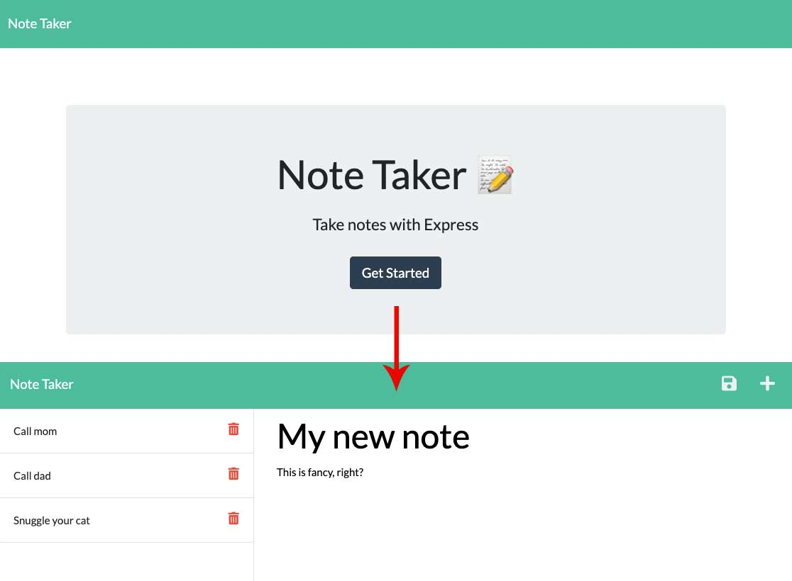

  
  # Note-Taker Application 

  ## Table of Contents
  * [ Description ](#about)
  * [ Usage ](#usage)
  * [ License ](#license)
  * [ Questions ](#questions)

  
  ## Description
  Node.js CLI application that can be used to write and save notes. Front-end code and functionality was already written. I used express to create api and HTML routes to allow the front-end to communicate with a back-end database.

  
  ## Usage
  ([URL of deployed application](https://evening-citadel-10512.herokuapp.com/))
  
  
  
  
  ## License
  MIT - A short and simple permissive license with conditions only requiring preservation of copyright and license notices. Licensed works, modifications, and larger works may be distributed under different terms and without source code. ([Read more about the MIT license](https://choosealicense.com/licenses/mit/))

  
  ## Questions
  Feel free to reach out to me with any additional questions
  * [Find me on GitHub](https://github.com/cshepscorp/)
  * Email me at: sheppard.christy@gmail.com
